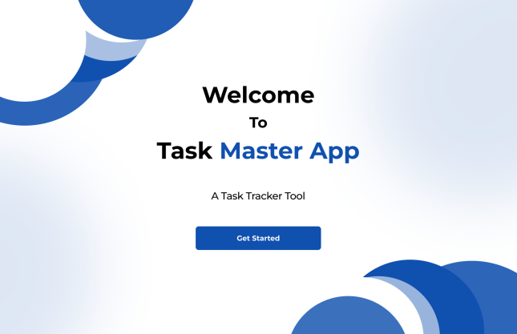
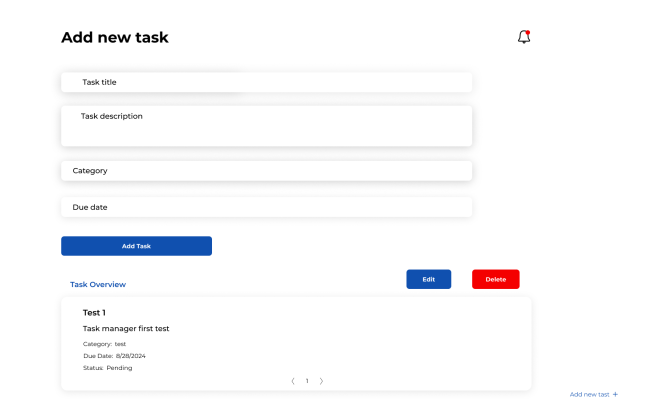

<h1>Task Master App</h1>
<i>a task tracker tool</i>

<h2>Introduction</h2>

Task Master is a comprehensive task management solution designed to help you efficiently organize and track your daily tasks. Whether you need to add, view, update, or delete tasks, Task Master has got you covered. Built with React for the front end and MongoDB for the back end, Task Master offers a seamless experience for managing your to-do lists and staying on top of your responsibilities.

<h2>Screenshot</h2>




<h2>Installation</h2>

To get a local copy up and running, follow these simple steps:

1. Clone the repository
   ```sh
   git clone https://github.com/Meertechnology/task-master-app.git

   ```
2. Navigate to the project directory

```sh
cd Task-Master-App
```

3. Install NPM packages

```sh
npm install
```

4. Create a .env.local file in the root directory and add your MongoDB URI and application URL:

```
MONGODB_URI=your-mongodb-uri
NEXTAUTH_URL=http://localhost:5000
```

5. Run the development server

```
npm run dev
```

6. Access the Application Open http://localhost:3000 in your browser to start using Task Master.

<h2>Usage</h2>
Once Task Master is up and running, you can manage your tasks with ease:<br>
- Add Tasks: Input new tasks to your list via the user-friendly interface.<br>
- View Tasks:  Access a consolidated view of all your tasks, making it easy to manage your workflow.<br>
- Update Tasks:  Edit existing tasks to reflect changes in your schedule or priorities.<br>
- Delete Tasks: Keep your to-do list relevant by removing completed or outdated tasks.<br>
- Landing Page: Access a welcoming landing page that introduces the app.

<h2>Contributing</h2>
Contributions are what make the open source community such an amazing place to be learn, inspire, and create. Any contributions you make are greatly appreciated.<br>
1. Fork the Project<br>
2. Create your Feature Branch (git checkout -b feature/AmazingFeature)<br>
3. Commit your Changes (git commit -m 'Add some AmazingFeature')<br>
4. Push to the Branch (git push origin feature/AmazingFeature)<br>
5. Open a Pull Request

<h2>Related Projects</h2>
Here are some related projects that might interest you:
-Another Task Tracker<br>
-Todo App<br>
-Task Manager

<h2>Licensing</h2>
Distributed under the MIT License. See LICENSE for more information.
